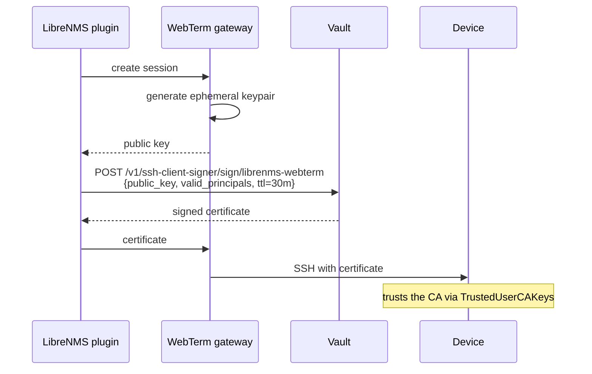

# HashiCorp Vault

The enterprise path. This page orients you; the pages beneath it are the procedure.

## Why bother

With the [database driver](../getting-started/quickstart.md), LibreNMS stores a reusable device password, encrypted. That is a reasonable trade for a small shop, but it has an uncomfortable property: **your monitoring database becomes a credential store**, and anything that reads that database plus the encryption key — a backup, a replica, a support bundle assembled carelessly — yields working credentials for your network.

Vault lets you do something structurally better. Instead of storing a secret that works forever, WebTerm asks Vault to **sign a freshly generated public key** and receives a certificate that is valid for thirty minutes, for one named principal.

The consequences are worth being precise about:

- **Nothing reusable is ever stored.** Not in the LibreNMS database, not in the gateway, not in a backup.
- **The private key never leaves the gateway process.** It is generated per session, used for one connection, and discarded. The plugin only ever handles the public half.
- **Devices stop holding per-user secrets.** They trust a CA public key. Onboarding and offboarding become a Vault policy change, not a password rotation across every device.
- **Vault's audit device records every signing request**, on a system your LibreNMS administrator does not necessarily control. That independence is what makes the record worth something.

## How it fits together

Note what the plugin never holds: the private key. And what Vault never sees: the device.

## Which flow to use

| Flow | Use when | Notes |
|---|---|---|
| **SSH signed certificates** | Linux/BSD servers, and network gear supporting OpenSSH certificates | The recommended default. Nothing reusable is stored anywhere. |
| **KV v2** | Devices that cannot do OpenSSH certificates | Vault holds the credential and WebTerm fetches it per session. Better than the database driver — central rotation, real audit — but the secret is still reusable while it exists. |

!!! warning "Check your network vendors before planning a rollout"

    OpenSSH certificate support across network equipment is uneven, and some vendors implement X.509-based SSH certificates that are **not** interchangeable with the OpenSSH format Vault issues. Verify against your own devices and firmware before assuming the certificate flow covers your fleet. A realistic estate usually ends up mixed: certificates for servers, KV v2 for the switches that cannot do them.

The flow is pinned **per device**, not guessed from the device's detected OS. Guessing here would mean a device silently receiving a long-lived password on a deployment whose whole security claim is that no long-lived secret leaves Vault.

## Choosing an authentication method

How WebTerm authenticates *to Vault*:

| Method | Use when | Trade-off |
|---|---|---|
| **Vault Agent** (recommended) | You can run the Vault Agent alongside LibreNMS | WebTerm never handles a Vault token or a SecretID. Agent owns renewal. Fewest secrets on disk. |
| **AppRole** | You cannot run the Agent | WebTerm holds a RoleID in config and a SecretID in a `0400` file, and manages token renewal itself. |

Both are supported. Prefer the Agent: it removes an entire class of credential-handling code from the application.

## Before you start

You will need:

- A reachable, unsealed Vault (Vault Enterprise namespaces are supported).
- Authority to enable a secrets engine and write a policy, or someone who has it.
- The ability to distribute a CA public key to your devices and set `TrustedUserCAKeys` — this is the step that needs a change window, so plan it first.

## An honest prerequisite

WebTerm **fails closed** when Vault is unreachable. There is no break-glass credential path, and that is deliberate: a second credential store with weaker protection would undermine the reason for using Vault at all.

The consequence is real. A network failure that partitions LibreNMS from Vault removes your terminal at exactly the moment an incident makes you want it. **Out-of-band access to your devices is a hard prerequisite**, not a nice-to-have. Keep your console servers, and test them.
