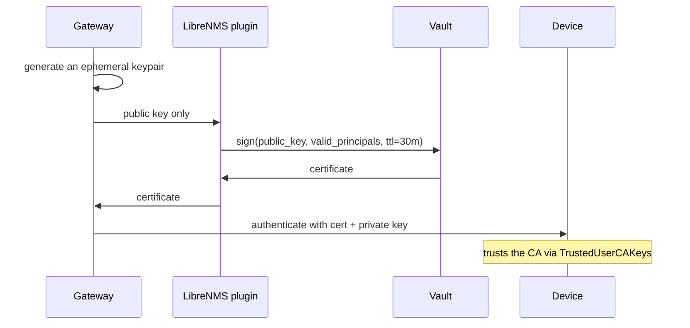

# The SSH secrets engine

Short-lived signed certificates. The reason to run Vault with WebTerm.

## How it works



The private key is generated inside the gateway, used for one session, and discarded. It never crosses a process boundary, so there is nothing durable to steal — not in the LibreNMS database, not in a backup, not in the gateway after the session ends.

## Setting it up

### 1. Enable the engine

```bash
vault secrets enable -path=ssh-client-signer ssh
vault write ssh-client-signer/config/ca generate_signing_key=true
```

### 2. Get the CA public key

```bash
vault read -field=public_key ssh-client-signer/config/ca
```

### 3. Trust it on your devices

=== "Linux / BSD"

    ```bash
    # on each device, as root
    vault read -field=public_key http://vault.example.com:8200/v1/ssh-client-signer/config/ca \
        > /etc/ssh/trusted-user-ca-keys.pem

    # /etc/ssh/sshd_config
    TrustedUserCAKeys /etc/ssh/trusted-user-ca-keys.pem
    ```

    ```bash
    systemctl reload sshd
    ```

=== "Network devices"

    Support varies considerably, and some vendors implement X.509-based SSH certificates that are **not** interchangeable with the OpenSSH format Vault issues.

    Check your own devices and firmware before planning a rollout. A realistic estate usually ends up mixed: certificates for servers, [KV v2](kv-v2.md) for the switches that cannot do them.

!!! warning "This step needs a change window"

    Distributing the CA key and editing `sshd_config` across an estate is the slow part. Plan it first; everything else here takes minutes.

### 4. Create the role

```bash
vault write ssh-client-signer/roles/librenms-webterm -<<'ROLE'
{
  "algorithm_signer": "rsa-sha2-512",
  "allow_user_certificates": true,
  "allowed_users": "netops,readonly",
  "default_user": "netops",
  "key_type": "ca",
  "default_extensions": { "permit-pty": "" },
  "ttl": "30m",
  "max_ttl": "60m",
  "not_before_duration": "5m"
}
ROLE
```

Each of these earns its place:

- **`allowed_users`** is the real constraint. WebTerm asks for a principal, and Vault refuses anything outside this list. Keep it to the accounts you actually intend.
- **`default_extensions: permit-pty`** and nothing else. No `permit-port-forwarding`, no `permit-agent-forwarding` — a certificate for a terminal session has no business enabling tunnels.
- **`ttl: 30m`** bounds the damage from a leaked certificate. Note it bounds new *authentications*, not established sessions: a session already open stays open.
- **`not_before_duration: 5m`** tolerates clock skew. Without it, a device whose clock runs slightly fast rejects a certificate that is technically not yet valid — a genuinely baffling failure to diagnose.
- **`allowed_critical_options`** and **`allowed_extensions`** are deliberately omitted pending verification of their empty-string semantics. If empty means allow-any in your Vault version, setting them incorrectly would permit `force-command` and `source-address` while appearing to restrict them.

### 5. Point WebTerm at it

```bash
# as the librenms user
./lnms webterm:config set credentials.driver vault
./lnms webterm:target:enable --device=server-01 --principal=netops --flow=ssh_signer
./lnms webterm:doctor
```

## Attribution, honestly

Each certificate carries a `key_id` that lands in the device's auth log:

```
librenms-webterm:jsmith:42
```

**This is a claim, not proof.** It says what the LibreNMS host told Vault, and an attacker who controls LibreNMS can write any name there. It is useful for ordinary operational attribution and useless against an adversary who owns your monitoring server.

The authoritative record is **Vault's own audit device**, on a system your LibreNMS administrator does not necessarily control — and only if you have enabled one:

```bash
vault audit enable file file_path=/var/log/vault/audit.log
```

Per-user Vault identity (OIDC entity aliases with `allowed_users_template`) would make attribution cryptographic rather than asserted. That is a future direction, not something v1.0 does.

## Troubleshooting

See [Vault troubleshooting](troubleshooting.md).
